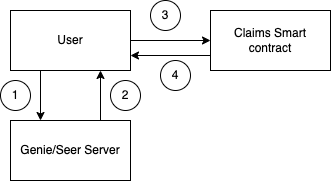

# [Readme Under Construction]

### Genie Flow Chart



### Claims Process:

1. User visits genie to request for a claim
2. Genie issues and signs a certificate [off-chain] to eligible user for the claim amount and address.
   Certificate details:

   1. Smart contract addr (required to prevent replay on other smart contracts)
   2. Claim amount
   3. User’s Address (Required to prevent someone else from claiming using this certificate)
   4. [secp256k1 signature](https://www.npmjs.com/package/secp256k1)

3. [Once only] User claims from smart contract using signed certificate.
   - In case of insufficient tokens in contract, user will be able to claim the remaining amount in the smart contract.
4. Smart contract sends coins to user :D

### Claim windows and actions allowed


Allowed actions during each state:

- Not started
  - Send tokens to smart contract address
  - Transfer unclaimed tokens
- On going
  - User claim tokens
- Ended
  - Transfer unclaimed tokens
- Invalid
  - Transfer unclaimed tokens

\*For now, Ended and Invalid will have the same behaviour.

## Contract actions

## InstantiateMsg

Creating a factory contract.

```json
{
  "owner": "terra123abc...",
  "public_key": "base64/+/public+key/+/SECP256K1/////////////",
  "asset_info": {"native_token":{"denom":"uluna"}}
  "from_timestamp": "1670222198",
  "from_timestamp": "1770222198"
}
```

## ExecuteMsg

### `claim`

Creating an airdrop contract using the factory.

```json
{
  "claim": {
    "amount": "1231231",
    "signature": "abcabc123base64signature"
  }
}
```

### `increase_incentives`

```json
{ "increase_incentives": {} }
```

### `transfer_unclaimed_tokens`

```json
{
  "transfer_unclaimed_tokens": {
    "recipient": "terraABC123...",
    "amount": "123123123"
  }
}
```

## QueryMsg

### `config`

```json
{ "config": {} }
=>
 {
   "owner": "terra1kdhzayc5ttl0pchgsctx4e4xy6cqg863j8zv9e",
   "asset": {
      "token": {
         "contract_addr": "terra167dsqkh2alurx997wmycw9ydkyu54gyswe3ygmrs4lwume3vmwks8ruqnv"
      }
   },
   "from_timestamp": 1672387874,
   "to_timestamp": 1672388314,
   "allocated_amount": "5000000"
}
```

### `status`

```json
{ "status": {} }
=>
{"status": "Ended"} or "Not started" or "Invalid" or "Ongoing"

```

### `state`

```json
{ "state": {} }
=>
{"unclaimed_tokens": "123000000"}
```

### `has_user_claimed`

```json
{ "has_user_claimed": { "address": "terraABCabc123..." } }
=>
{"is_claimed": true}
```

### `user_info`

```json
{ "user_info": { "address": "terraABCabc123..." } }
=>
{"airdrop_amount": "2000000"}
```
