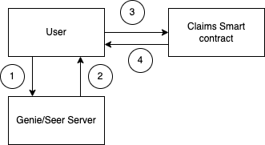

# `genie-airdrop`

## Flow Chart

1. User requests server to claim
2. Server verifies claim and issues a signed certificate which contains the following information:
   1. Smart contract address to claim from
   2. Claim amount
   3. User's address
3. User passes the signed certificate to the smart contract
4. Smart contract verifies the signed certificate and transfers the claim amount to the user if valid

## Claim windows and actions allowed

Allowed actions during each state:

- Not started
  - Deposit rewards
  - Withdraw unclaimed rewards (owner only)
- On going
  - Claim rewards
- Ended
  - Withdraw unclaimed rewards (owner only)
- Invalid
  - Withdraw unclaimed rewards (owner only)
